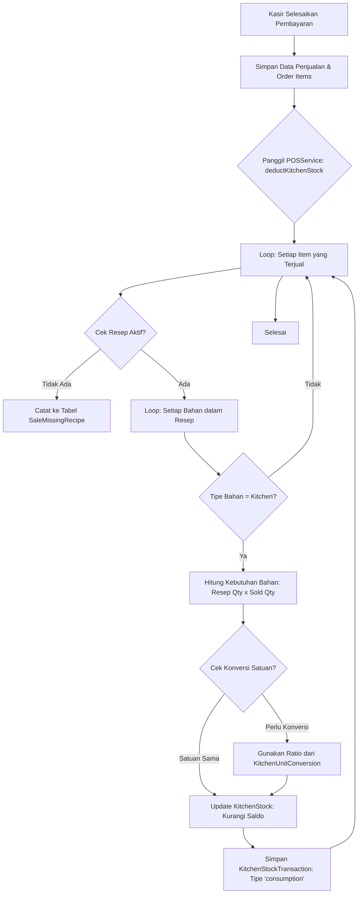

# Dokumentasi Alur Pengurangan Stok Dapur Otomatis (POS)

Dokumen ini menjelaskan bagaimana sistem **Wartegkee** secara otomatis mengurangi stok dapur setiap kali terjadi transaksi penjualan di Kasir (POS).

## 1. Gambaran Umum
Fitur ini menjamin bahwa setiap porsi makanan yang terjual akan langsung memotong saldo stok bahan baku di dapur berdasarkan **Resep** yang telah ditentukan. Jika stok tidak mencukupi atau resep belum dibuat, sistem akan memberikan log informasi agar manajemen dapat melakukan audit.

## 2. Komponen Teknis Utama
| Komponen | Lokasi File | Peran |
|----------|-------------|-------|
| **POSService** | `backend/app/Services/POSService.php` | Otak utama yang menjalankan logika pengurangan stok. |
| **Recipe** | `backend/app/Models/Recipe.php` | Model yang menyimpan daftar bahan baku untuk setiap produk. |
| **KitchenStock** | `backend/app/Models/KitchenStock.php` | Menyimpan saldo stok dapur saat ini. |
| **Unit Conversion**| `backend/app/Models/KitchenUnitConversion.php` | Menangani perbedaan satuan (misal: Stok KG, Resep Gram). |

## 3. Diagram Alur Kerja



## 4. Penjelasan Langkah-Demi-Langkah

### A. Pemicu (Trigger)
Proses dimulai di dalam fungsi `processOrder()` pada `POSService.php` setelah transaksi berhasil disimpan ke database.

### B. Validasi Resep
Sistem mencari resep menggunakan kode berikut:
```php
$recipe = Recipe::where('product_id', $productId)
    ->where('is_active', true)
    ->with('items')
    ->first();
```
Jika produk tidak punya resep aktif, sistem **tidak akan membatalkan transaksi**, melainkan mencatatnya sebagai "Missing Recipe" agar kasir tetap bisa berjualan namun stok tetap terpantau selisihnya.

### C. Logika Konversi Satuan
Sistem sangat fleksibel terhadap satuan. Jika stok dapur menggunakan satuan **KG** tetapi resep menggunakan **Gram**, sistem akan mencari rasio konversi:
- **Contoh**: Rasio 1 KG = 1000 Gram. 
- Jika resep butuh 200 Gram, maka stok dapur akan dikurangi `200 / 1000 = 0.2 KG`.

### D. Pencatatan Transaksi (Audit Trail)
Setiap pengurangan stok akan masuk ke tabel `kitchen_stock_transactions` dengan keterangan:
`"Auto-deduct: [Jumlah]x [Nama Produk] (INV#[Nomor Invoice])"`
Ini memungkinkan Anda melacak setiap gram bahan yang keluar dari dapur secara akurat.

## 5. Prasyarat agar Berjalan Otomatis
Agar fitur ini bekerja dengan benar, pastikan Anda telah melakukan hal berikut:
1. **Daftarkan Bahan**: Tambahkan bahan baku di menu **Stok Dapur**.
2. **Buat Resep**: Di menu produk, buat resep dan tambahkan bahan-bahan dapur yang tadi didaftarkan.
3. **Aktifkan Resep**: Pastikan status resep adalah **Aktif**.
4. **Hubungkan Produk**: Pastikan produk yang dijual di Kasir adalah produk yang sama dengan yang telah dibuatkan resepnya.

---
*Dibuat otomatis oleh Sistem Antigravity - 2026*
